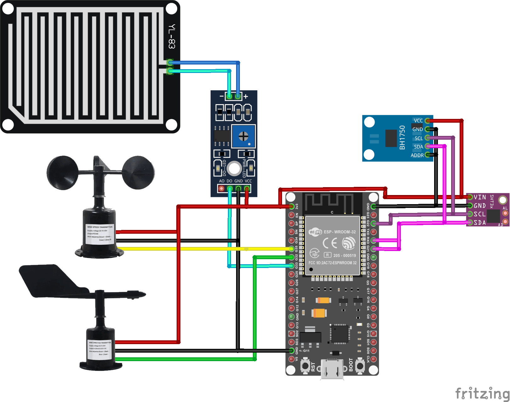

# 🌤️ Smart Air Monitoring & Weather Station (IoT)

 

*Note: This project was developed as part of an educational mentoring program for hardware engineering students.*

---

## 🇬🇧 English Version

A fully functional IoT outdoor weather station powered by an ESP32 microcontroller. The system continuously aggregates meteorological data from various digital and analog sensors, categorizes the current weather status, and visualizes the insights on a responsive local Web Dashboard.

### 🚀 Key Technical Features
* **Meteorological Sensing:** Tracks Temperature & Humidity (SHT31 via I2C), Light Intensity/Lux (BH1750 via I2C), Rain state, Wind Speed (Anemometer), and Wind Direction (Analog Wind Vane).
* **Predictive Logic:** Automatically categorizes real-time weather conditions (Sunny, Cloudy, Dark, Rainy) based on combined Lux and Rain sensor logic.
* **Dynamic Web Dashboard:** * Hosts an embedded HTML/JS/CSS web server directly on the ESP32.
  * Features a dynamic **Google Charts Gauge** for real-time wind speed visualization.
  * Implements a custom mathematical **SVG Digital Compass** that rotates the needle based on analog wind direction mapping.
* **Network Resilience:** Incorporates a Fallback AP Mode (Captive Portal) with EEPROM storage. If the primary WiFi disconnects, it broadcasts an `ESP01_AQM` network to allow users to update credentials via a web form.

### 🛠️ Hardware Architecture & Wiring

| Component | Interface / Pin | Role |
| :--- | :--- | :--- |
| **ESP32 (WROOM-32)** | Core | Main processing, Web Server, WiFi |
| **SHT31** | I2C | Temp & Humidity |
| **BH1750** | I2C | Light Intensity (Lux) |
| **Rain Sensor (YL-83)**| GPIO 33 (Digital) | Rain drop detection |
| **Wind Vane** | GPIO 35 (Analog) | 8-direction wind mapping via resistor network |
| **Anemometer** | GPIO 32 (Analog) | Wind speed calculation |

---

## 🇻🇳 Bản Tiếng Việt

Trạm quan trắc khí tượng ngoài trời IoT sử dụng vi điều khiển ESP32. Hệ thống thu thập dữ liệu từ đa dạng các cảm biến (cả Digital, Analog và I2C), phân tích trạng thái thời tiết và hiển thị trực quan thông qua một Web Server nội bộ mượt mà. Đã được triển khai và thử nghiệm độ bền thực tế ngoài trời.

### 🚀 Tính năng kỹ thuật nổi bật
* **Đo lường Khí tượng:** Theo dõi Nhiệt độ/Độ ẩm (SHT31), Cường độ ánh sáng (BH1750), Lượng mưa, Tốc độ gió và Hướng gió.
* **Thuật toán nội suy thời tiết:** Tự động phân loại thời tiết (Nắng, Nhiều mây, Trời tối, Mưa) dựa trên logic kết hợp giữa cảm biến quang (Lux) và cảm biến nước mưa.
* **Giao diện Web nâng cao:** * Web Server được nhúng trực tiếp vào bộ nhớ flash của ESP32.
  * Hiển thị tốc độ gió bằng biểu đồ động **Google Charts Gauge**.
  * Vẽ **La bàn số bằng công nghệ SVG**, tự động tính toán góc quay kim la bàn (0° đến 315°) theo tín hiệu điện áp trả về từ Wind Vane.
* **Cấu hình mạng thông minh:** Tích hợp tính năng Captive Portal. Khi mất kết nối WiFi, thiết bị tự động phát trạm phát WiFi nội bộ để người dùng truy cập và cấu hình lại mạng mà không cần nạp lại Firmware.

### ⚙️ Hướng dẫn cài đặt
1. Cài đặt các thư viện cần thiết trong Arduino IDE: `Adafruit_SHT31`, `BH1750FVI_RT` (hoặc thư viện tương đương cho BH1750).
2. Thiết lập thông tin mạng ban đầu trong `secrets.h` hoặc sử dụng tính năng Captive Portal bằng cách kết nối vào WiFi `ESP01_AQM` sau khi khởi động.
3. Nạp code từ file `esp32_AirMonitoringSystem/esp32_AirMonitoringSystem.ino` xuống ESP32. Truy cập địa chỉ IP được in ra trên Serial Monitor để xem Dashboard.
